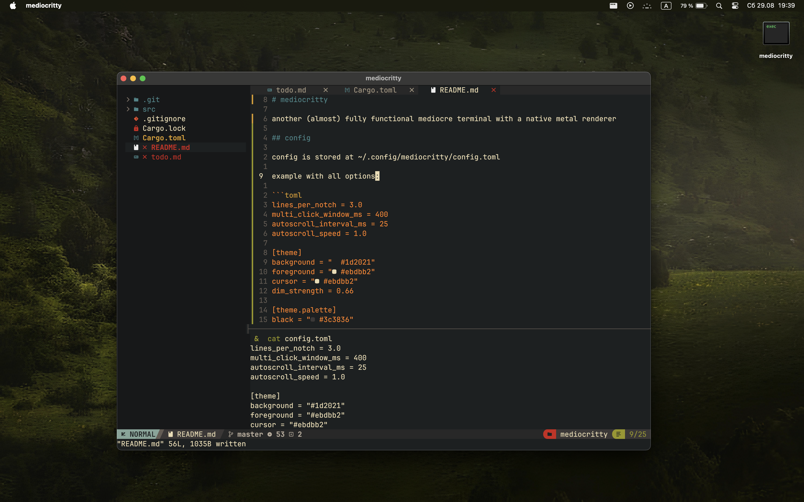

# mediocritty

another (almost) fully functional mediocre terminal with a native metal renderer



## config

config is stored at ~/.config/mediocritty/config.toml

example with all options:

```toml
lines_per_notch = 3.0
multi_click_window_ms = 400
autoscroll_interval_ms = 25
autoscroll_speed = 1.0

[theme]
background = "#1d2021"
foreground = "#ebdbb2"
cursor = "#ebdbb2"
dim_strength = 0.66

[theme.palette]
black = "#3c3836"
red = "#cc241d"
green = "#98971a"
yellow = "#d79921"
blue = "#458588"
magenta = "#b16286"
cyan = "#689d6a"
white = "#a89984"

bright_black = "#928374"
bright_red = "#fb4934"
bright_green = "#b8bb26"
bright_yellow = "#fabd2f"
bright_blue = "#83a598"
bright_magenta = "#d3869b"
bright_cyan = "#8ec07c"
bright_white = "#ebdbb2"

[font]
size = 15.0
family = "JetBrainsMonoNF-Regular"
fallback = ["Apple Color Emoji", "Apple Symbols", "Hiragino Sans"]
gamma = 1.7
contrast = 30.0
bold_is_bright = false

[cursor]
hollow_cursor_thickness = 0.1

[shell]
locale = "en_US.UTF-8"
```

## any problems?

feel free to fork repository or create issues
